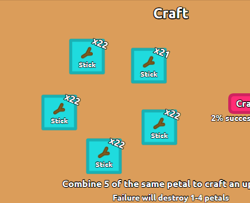

# florr.io Auto Farm sszone Script

[中文版本](./README-zh-cn.md)

## Deploy (py3.9.15)

```bash
pip install -r py39-requirements.txt
python ./main.py
```

This project depends on yolov10(ultralytics). For installing problems please visit https://github.com/ultralytics/ultralytics

Use pytorch-gpu for better performance. (Needs CUDA and cuDNN)

## Running

1. Open https://florr.io/
2. Make sure you fullscreen the tab (F11)
3. Always keep your florr window on top
4. Maximize your florr map (M)
5. Run the script
6. Drag your mouse to the edge of the screen to terminate the script

## Config

```
config.json
```

You can see the status by setting `ShowLogger` to `true`

Change `Builds` to the build number you want to use when farming

If you can't reach sandstorms, please reduce the value of  `SafeDistanceK`(>0)

If you hate mythic sandstorms，you can reduce the value `Mythic` in `Weights`

## Efficiency (1 week)

gg




| Rarity   | Sand | Stick | Glass |
| :------- | ---- | ----- | ----- |
| Epic     | 22k  | 12k   | 19k   |
| Lgendary | 6k   | 5k    | 6k    |
| Mythic   | 26   | 13    | 31    |
